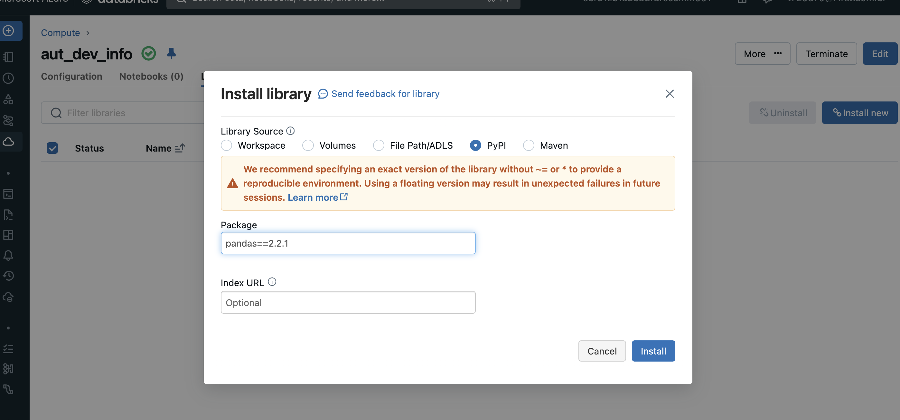

Databricks Runtime for Machine Learning

## 1- Create a cluster with the Databricks Runtime for Machine Learning.
    To create a cluster with the Databricks Runtime for Machine Learning (ML), follow these steps:

    1- Open your Databricks workspace.

    2- Click on the "Clusters" tab on the left-hand sidebar.

    3- Click on the "Create Cluster" button.

    4- In the "Cluster Name" field, provide a name for your cluster.

    5- Choose an appropriate Databricks Runtime version that includes "ML" in its name. For example, "Databricks Runtime 9.0 ML (includes Apache Spark 3.1.1, Scala 2.12)".

    6- Configure the cluster with the desired instance types, auto-scaling settings, and other options based on your requirements.

    7- Under the "Advanced Options" section, you can customize various settings related to initialization scripts, environment variables, libraries, and more. You can add libraries such as PyPI, Maven, or JARs to enhance your ML capabilities.

    8- Optionally, you can add tags to the cluster for better organization and management.

    9- Review the configuration and click on the "Create Cluster" button to create the cluster with the Databricks Runtime for ML.

    10- Databricks will provision the cluster with the specified configuration. The cluster will be ready for executing ML workloads that leverage the enhanced ML features and capabilities provided by the Databricks Runtime for Machine Learning.

    Note that the steps outlined above are general instructions, and the exact steps and options may vary based on your Databricks workspace configuration and access privileges.

## 2- Install a Python library to be available to all notebooks that run on a cluster.

    To install a Python library to be available to all notebooks that run on a cluster in Databricks, you can follow these steps:

    1- Open your Databricks workspace.

    2- Navigate to the "Clusters" tab on the left-hand sidebar.

    3- Select the cluster on which you want to install the Python library. Make sure the cluster is running or create a new cluster.

    4- Click on the cluster to open the cluster configuration.

    5- Scroll down to the "Cluster Libraries" section.

    6- Click on the "Install New" button to add a new library.

    7- In the Library Source dropdown, select the appropriate source based on your library:

        - To install a library from PyPI, select "PyPI" and enter the package name.
        - To install a library from a Maven repository, select "Maven Coordinate" and enter the Maven coordinates for the package.
        - To upload a library or .egg file, select "Upload Python Egg or PyPI" and upload the file.

    

    8- If needed, specify the specific version or provide any additional configuration settings required for the library installation.

    9- Choose the "Install Automatically" option to have the library installed on all existing and future clusters.

    10- Click on the "Install" button to install the library on the cluster.

    11- Once the library is successfully installed, it will be available to all notebooks that run on the cluster. You can import and use the library in your notebooks without any additional installation steps.

    Note that the installation process may take a few moments depending on the library size and the cluster configuration. Also, ensure that the cluster is running and has an internet connection to download and install the library.